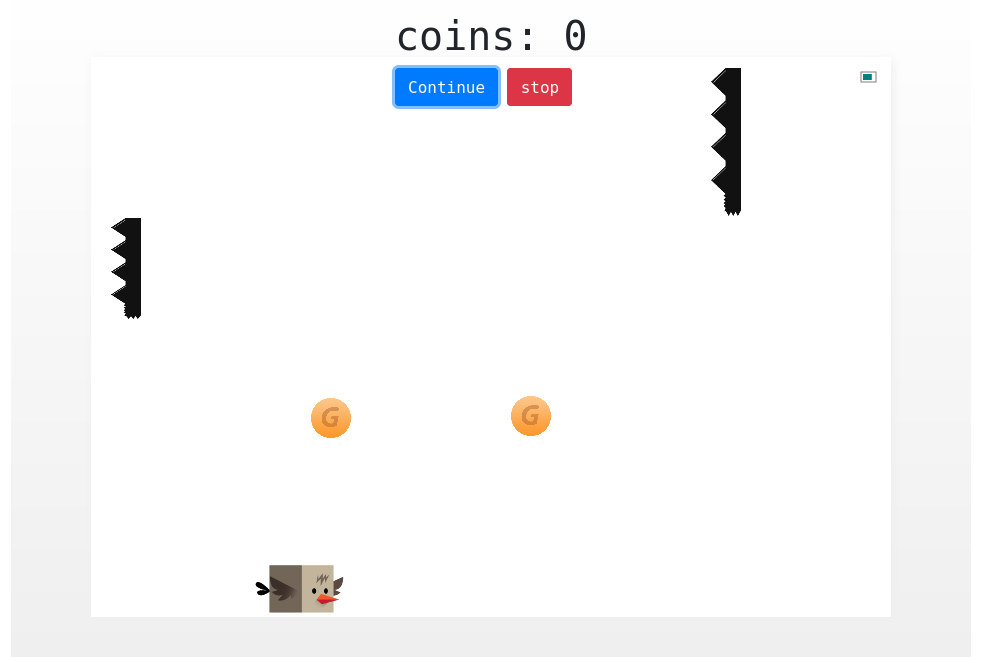
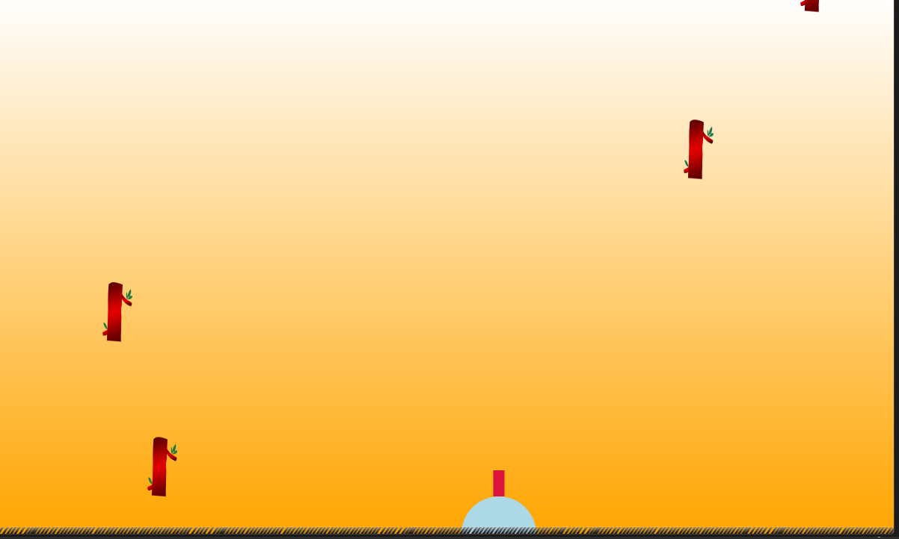
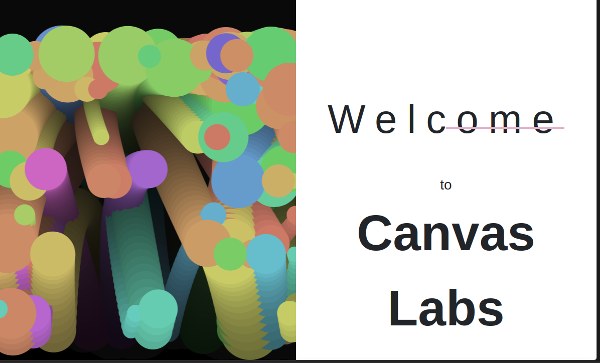

# Lexus Game Engine

[Lexus](./Lexus/lexus.js) is a lightweight javascript 2D game engine.

## Samples

These are a sample collection of games built with a library called **Lexus.js**. 

The following are examples of games built with **lexus.js**

## Dodge Bird

Dodge bird is an implementation of the classic [flappy bird game](https://kingwilliamsgpt.github.io/Lexus.js/LexusGames/dodge_bird/).

## Froger 

Froger is a shooter game, where you shoot trees falling from the sky. There are powerups that explode or slow down the trees.
Your job is to shot as many trees as possible. This game is still pretty much incomplete and still in it's primitive state.

## Simulations

Although not games these shows simulations of gravity and projectile physics phenomena implemented in **lexus.js**.

**Gravity**
This example is a simulation of how smooth the library can render physics
[check it out here](https://kingwilliamsgpt.github.io/Lexus.js/LexusGames/Simulations/gravity.html/).

